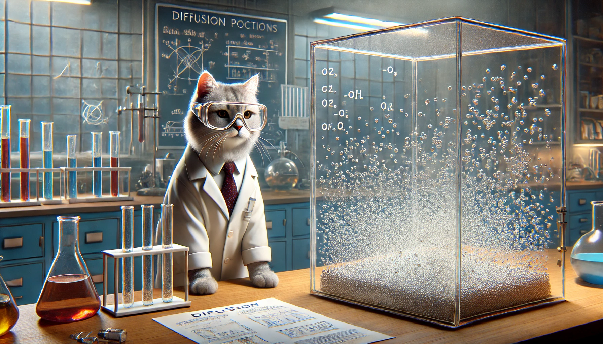

# Introduction to Diffusion Models

Welcome to the Introduction to Diffusion Models workshop offered by the Accelerate Programme for Scientific Discovery. Here you will find the slides for our in-person workshop, along with some material to get started.

This workshop was originally delivered in-person at the University of Cambridge, but we have made the slides and some of the material available here for you to work through at your own pace.

In the main GitHub repository, there is a `notebooks` folder that contains the Jupyter notebooks that we used in the workshop. These notebooks are designed to be run on a local machine, and we recommend that you use a machine with a GPU to run them. If you don't have a GPU, you can use Google Colab to run the notebooks. Contained within the main repository is also a folder `diffusion_models` that contains the code for the Diffusion Models that we build in the workshop.

[:fontawesome-solid-book:  Notebooks ](mailto:accelerate-mle@cst.cam.ac.uk){ .md-button }

This workshop is roughly divided into the following sections:

## Introduction
An overview of the Accelerate Programme, and the history of image generation, including:
- VAEs
- GANs
- Diffusion

## Physics
How we can draw inspiration from the world of physics by exploring diffusion in fluids and charge distributions.

## Building Blocks
An overview of the building blocks of the Stable Diffusion model. We have a detailed look at:

- VAEs

- UNet
    - Segmetation
    - CNNs
    - Residual connections
    - Upsampling, pooling and normalization
- CLIP

Included in this is some example code that aims to build each of these components from scratch in a manner that will run on a local machine (such as a laptop or Macbook).

## The DDPM algorithm
We take a deep dive into the Denoising Diffusion Probabilistic Model algorithm and implement it ourselves using the components that we have already built. We also introduce the Hugging Face Diffusers library to make our lives easier.

## Applications of diffusion models
How people are using diffusion models in scientific research, and how are they being improved.

## Ethics
We look at three different ethics case studies and give you the opportunity to present your thoughts and opinions on generative AI in society and research.